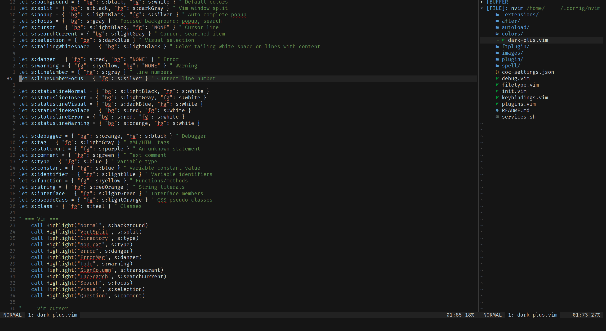
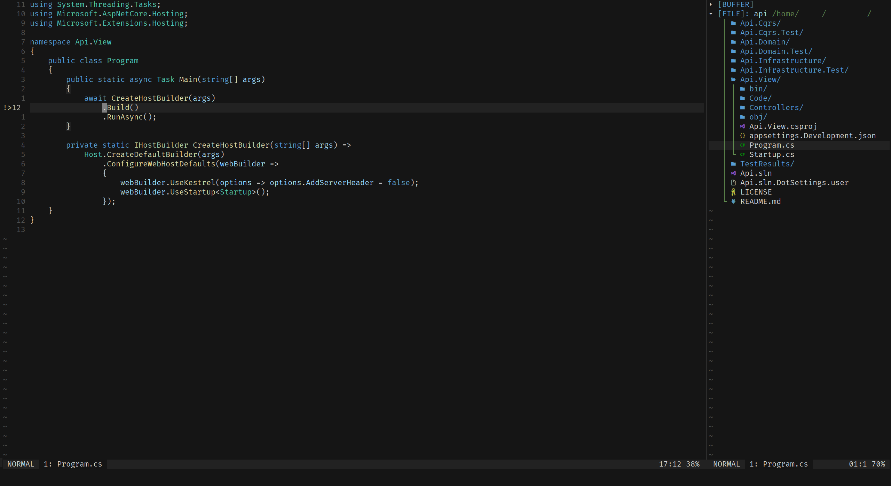

# NeoVIM

Visual Studio (Code) dark theme

## Fonts
* [Fira code](https://github.com/tonsky/FiraCode)
* [Nerd font](https://github.com/ryanoasis/nerd-fonts)

## Key bindings

| Key(s)           | Action                             | Mode  | file type | extension     |
| ---------------- | ---------------------------------- | ----- | --------- | ------------- |
| space            | leader                             |       |           |               |
| jj               | Exit insertion mode!               | i     |           |               |
| leader+leader    | Save document                      | n     |           |               |
| leader+[         | Move to the previous tag           | n     |           |               |
| leader+]         | Move to the next tag               | n     |           |               |
| leader+=         | Format selection                   | n     |           | COC           |
| leader+=         | Format selection                   | v     |           | COC           |
| leader+b         | Easy motion: back                  | n     |           | EasyMotion    |
| leader+B         | Easy motion: Back                  | n     |           | EasyMotion    |
| leader+d         | Documentation                      | n     | cs        |               |
| leader+e         | Easy motion: end                   | n     |           | EasyMotion    |
| leader+E         | Easy motion: End                   | n     |           | EasyMotion    |
| leader+f         | Easy motion: find                  | n     |           | EasyMotion    |
| leader+F         | Easy motion: Find                  | n     |           | EasyMotion    |
| leader+g         | Toggle git gutter                  | n     |           | GitGutter     |
| leader+g+d       | Find usages                        | n     | cs        |               |
| leader+m         | Show GIT commit message            | n     |           | GitMessager   |
| leader+o         | Show file outline                  | n     |           | COC           |
| leader+s         | Easy motion: Search                | n     |           | EasyMotion    |
| leader+r+r       | Reload the VIM rc                  | n     |           |               |
| leader+t         | Easy motion: till                  | n     |           | EasyMotion    |
| leader+T         | Easy motion: Till                  | n     |           | EasyMotion    |
| leader+w         | Easy motion: word                  | n     |           | EasyMotion    |
| leader+W         | Easy motion: Word                  | n     |           | EasyMotion    |
| leader+y         | Show yank history                  | n     |           | COC           |
| F2               | Rename symbol                      | n     |           | COC           |
| F3               | Grep popup dialog                  | n     |           |               |
| F4               | Grep files popup dialog            | n     |           |               |
| F5               | Compile PFD LaTeX                  | n     | tex       |               |
| F6               | Compile Xe LaTeX                   | n     | tex       |               |
| F7               | Compile biber                      | n     | tex       |               |
| F10              | Show highlight group               | n     |           |               |
| CTRL+space       | Refresh COC auto complete          | n     |           | COC           |
| CTRL+h           | Move pane left                     | n     |           |               |
| CTRL+j           | Move pane up                       | n     |           |               |
| CTRL+k           | Move pane down                     | n     |           |               |
| CTRL+l           | Correct previous spelling mistake  | i     |           |               |
| CTRL+l           | Move pane right                    | n     |           |               |
| CTRL+p           | Paste on new line down             | n     |           |               |
| CTRL+t           | Fuzzy find files                   | n     |           | FZF           |
| ALT+e            | Global code check                  | n     | cs        |               |
| ALT+p            | Paste on new line up               | n     |           |               |
| ALT+r            | Restart COC plugin                 | n     | cs        |               |
| ALT+t            | Open file explorer                 | n     |           | COC           |
| ALT+enter        | Code actions                       | n     | cs        |               |
| ALT+enter        | Show COC actions                   | n     |           | COC           |
| [+e              | Next error                         | n     |           |               |
| ]+e              | Previous error                     | n     |           |               |
| [+g              | Previous error/warning/note        | n     |           |               |
| ]+g              | Next error/warning/note            | n     |           |               |
| [+w              | Previous warning                   | n     |           |               |
| ]+w              | Next warning                       | n     |           |               |
| g+b              | Go to previous buffer              | n     |           |               |
| g+d              | Find definition                    | n     | cs        |               |
| g+d              | Go to definition                   | n     |           | COC           |
| g+D              | Find implementation                | n     | cs        |               |
| g+D              | Go to implementation               | n     |           | COC           |
| g+n              | Go to next buffer                  | n     |           |               |
| g+r              | Go to references                   | n     |           | COC           |
| g+s              | Find symbols                       | n     | cs        |               |
| K                | Show documentation                 | n     |           | COC           |

## Commands
| Command       | Action                        | File type |
| ------------- | ----------------------------- | --------- |
| WS            | Save buffer as sudo user      |           |
| W             | Save file                     |           |
| WQ            | Save file and quit            |           |
| Wq            | Save file and quit            |           |
| Q             | Quit                          |           |
| Reloadrc      | Reload the VIM rc             |           |
| GenerateTags  | Generate tags                 | aspvbs    |
| WordCount     | Calculate LaTex word cound    | tex       |

## Plugins
| Plugin                                                                            | Functionality                     |
| --------------------------------------------------------------------------------- | --------------------------------- |
| [sheerun/vim-polyglot](https://github.com/sheerun/vim-polyglot)                   | Syntax for a lot of extensions.   |
| [junegunn/fzf](https://github.com/junegunn/fzf)                                   | Fuzzy file search.                |
| [junegunn/fzf.vim](https://github.com/junegunn/fzf.vim)                           | Fuzzy file search.                |
| [liuchengxu/vim-clap](https://github.com/liuchengxu/vim-clap)                     | Grep and Fuzzy file search        |
| [psliwka/vim-smoothie](https://github.com/psliwka/vim-smoothie)                   | Smooth scrolling                  |
| [easymotion/vim-easymotion](https://github.com/easymotion/vim-easymotion)         | Jump to tekst with shortcuts      |
| [scrooloose/nerdcommenter](https://github.com/scrooloose/nerdcommenter)           | Toggle code comments              |
| [wellle/targets.vim](https://github.com/wellle/targets.vim)                       | More text objects                 |
| [tpope/vim-repeat](https://github.com/tpope/vim-repeat)                           | Better command repeat             |
| [tpope/vim-abolish](https://github.com/tpope//vim-abolish)                        | Better substitution               |
| [jremmen/vim-ripgrep](https://github.com/jremmen/vim-ripgrep)                     | Better vim searching with tags    |
| [vim-scripts/SearchComplete](https://github.com/vim-scripts/SearchComplete)       | Auto complete search results      |
| [rhysd/git-messenger.vim](https://github.com/rhysd/git-messenger.vim)             | Show Git commit message popup     |
| [airblade/vim-gitgutter](https://github.com/airblade/vim-gitgutter)               | Show Git status in status line    |
| [andymass/vim-matchup](https://github.com/andymass/vim-matchup)                   | Highlight brace matches           |
| [jiangmiao/auto-pairs](https://github.com/jiangmiao/auto-pairs)                   | Auto insert braces                |
| [dense-analysis/ale](https://github.com/dense-analysis/ale)                       | Linting engine                    |
| [neoclide/coc.nvim](https://github.com/neoclide/coc.nvim)                         | Auto completion engine            |
| [OmniSharp/omnisharp-vim](https://github.com/OmniSharp/omnisharp-vim)             | C# integration                    |
| [rust-lang/rust.vim](https://github.com/rust-lang/rust.vim)                       | Rust integration                  |
| [iamcco/markdown-preview.nvim](https://github.com/iamcco/markdown-preview.nvim)   | Live preview Markdown files       |

